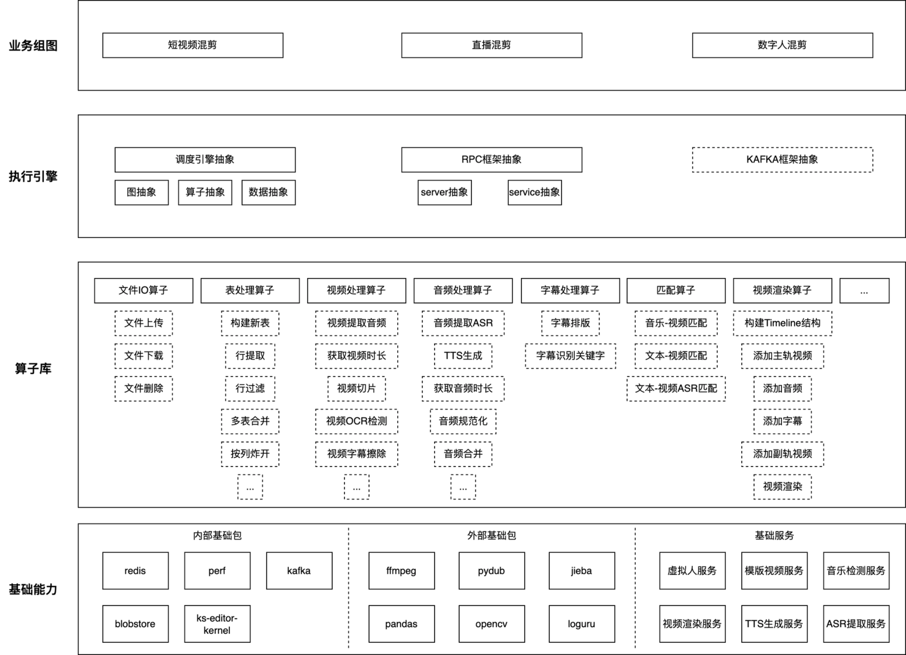

# 框架简介

video-graph是一个基于Python搭建的视频生产框架，有以下特点：

* 开箱即用的算子库：内部集成了视频剪辑常用的算子，可以快速地搭建出一个视频剪辑流程
* 调试/部署双模式：
	* 调试模式（eager）：应对新场景的搭建、批量跑demo的情况，可以用原生的Python语法，也可以用算子库内算子，灵活性高
	* 部署模式（graph）：新场景正式上线部署时，用该模式可以得到较好的性能，框架会做图优化，提高运行速度
* 轻松部署rpc服务：框架封装了rpc服务部署的细节，只需要简单配置即可部署一个新服务
* 服务白盒化支持：框架有统一的天问监控，可以看到算子粒度的执行指标，此外也有统一的日志落表，方便问题分析排查

video-graph整体框架图：


## 快速上手
1. 部署镜像，框架运行依赖了很多python三方包，可以使用这个镜像部署环境：
`registry.corp.kuaishou.com/kml-ad/ubuntu20.04-video-graph:cuda11-py38-ffmpeg-torch-editor-kernel-20240923-1807`

2. 安装video-graph包
```shell
pip install -U ks-video-graph -i https://pypi.corp.kuaishou.com/kuaishou/staging
pip install -U ks-editor-kernel -i https://pypi.corp.kuaishou.com/kuaishou/staging
apt install mesa-utils libgles2-mesa
apt install libegl1
```

3. 引入依赖包，并做初始化
```python
from video_graph.common.utils.logger import logger
from video_graph.data_table import DataTable
from video_graph.eager import call_op, eager_init
from video_graph.ops.all_op import *

eager_init()
```

4. 编写剪辑流程代码
参考：[example](example/eager/test_eager_v2.py)，如果上面步骤都没问题的话，example中的代码可以直接运行

* case1：在一个视频中添加标题和字幕：
```python
def test_title_subtitle():
    test_table = DataTable(name="test_table", data={
        "video_blob_key": ["video_def_144419305964.mp4"], # 源视频
        "start_time": [0], # 视频开始时间
        "end_time": [10], # 视频结束时间
        "title": ["UC浏览器，一键搜索，快来下载！"], # 标题文字
        "title_duration": [10], # 标题持续时间
        "subtitle_group_with_keyword": [ # 字幕组
            [
                [
                    0, # 开始时间
                    10, # 结束时间
                    [["这是", "一个", "字幕"], ["一个", "测试", "的", "字幕"]], # 字幕
                    [["字幕"], ["测试"]] # 关键词
                ]
            ]
        ]
    })

    timeline_table, = build_table_op(table_name="timeline_table")
    timeline_table, = create_minecraft_request_new_op(timeline_table)
    timeline_table, = add_main_video_track_op(timeline_table, test_table)
    timeline_table, = add_title_track_op(timeline_table, test_table, auto_wrap=True,
                                         duration_column="title_duration")
    timeline_table, = add_subtitle_track_op(test_table, timeline_table,
                                            font="ad_nieuwland-material_汉仪雅酷黑85W.ttf",
                                            font_color="#FFFFFF",
                                            stroke_color="#FF606B",
                                            stroke_width=8,
                                            keyword_text_scale_ratio=1.5)
    timeline_table, = video_render_new_op(timeline_table)
    logger.info(timeline_table[["video_output_blob_key"]])

test_title_subtitle()

# 输出：
2024-10-12 10:56:56.660 | INFO     | [139871473682240][49207] [/home/zhangyunhao03/zhangyunhao03/video_graph/video_graph/op.py:17:call_method] 算子[BuildTableOp_RMQ9SZ]开始运行...
2024-10-12 10:56:56.664 | INFO     | [139871473682240][49207] [/home/zhangyunhao03/zhangyunhao03/video_graph/video_graph/op.py:23:call_method] 算子[BuildTableOp_RMQ9SZ]运行成功，耗时：2ms
2024-10-12 10:56:56.665 | INFO     | [139871473682240][49207] [/home/zhangyunhao03/zhangyunhao03/video_graph/video_graph/op.py:17:call_method] 算子[CreateMinecraftRequestNewOp_AWSY6N]开始运行...
2024-10-12 10:56:56.670 | INFO     | [139871473682240][49207] [/home/zhangyunhao03/zhangyunhao03/video_graph/video_graph/op.py:23:call_method] 算子[CreateMinecraftRequestNewOp_AWSY6N]运行成功，耗时：5ms
2024-10-12 10:56:56.671 | INFO     | [139871473682240][49207] [/home/zhangyunhao03/zhangyunhao03/video_graph/video_graph/op.py:17:call_method] 算子[AddMainVideoTrackOp_RTIT62]开始运行...
2024-10-12 10:56:56.673 | INFO     | [139871473682240][49207] [/home/zhangyunhao03/zhangyunhao03/video_graph/video_graph/op.py:23:call_method] 算子[AddMainVideoTrackOp_RTIT62]运行成功，耗时：2ms
2024-10-12 10:56:56.674 | INFO     | [139871473682240][49207] [/home/zhangyunhao03/zhangyunhao03/video_graph/video_graph/op.py:17:call_method] 算子[AddTitleTrackOP_CPG5O2]开始运行...
2024-10-12 10:56:56.677 | INFO     | [139871473682240][49207] [/home/zhangyunhao03/zhangyunhao03/video_graph/video_graph/op.py:23:call_method] 算子[AddTitleTrackOP_CPG5O2]运行成功，耗时：2ms
2024-10-12 10:56:56.678 | INFO     | [139871473682240][49207] [/home/zhangyunhao03/zhangyunhao03/video_graph/video_graph/op.py:17:call_method] 算子[AddSubtitleTrackOp_LYKTW1]开始运行...
2024-10-12 10:56:56.690 | INFO     | [139871473682240][49207] [/home/zhangyunhao03/zhangyunhao03/video_graph/video_graph/op.py:23:call_method] 算子[AddSubtitleTrackOp_LYKTW1]运行成功，耗时：11ms
2024-10-12 10:56:56.691 | INFO     | [139871473682240][49207] [/home/zhangyunhao03/zhangyunhao03/video_graph/video_graph/op.py:17:call_method] 算子[VideoRenderNewOp_GDZEYO]开始运行...
2024-10-12 10:56:57.208 | INFO     | [139871473682240][49207] [/home/zhangyunhao03/zhangyunhao03/video_graph/video_graph/common/client/media_process_client.py:65:_async_wait] waiting for video render res, detail: https://conductor.corp.kuaishou.com/execution/2e6c3923-c232-4afb-9ba9-a41a05245e37-20241012-0-1
2024-10-12 10:56:59.211 | INFO     | [139871473682240][49207] [/home/zhangyunhao03/zhangyunhao03/video_graph/video_graph/common/client/media_process_client.py:65:_async_wait] waiting for video render res, detail: https://conductor.corp.kuaishou.com/execution/2e6c3923-c232-4afb-9ba9-a41a05245e37-20241012-0-1
2024-10-12 10:57:01.215 | INFO     | [139871473682240][49207] [/home/zhangyunhao03/zhangyunhao03/video_graph/video_graph/common/client/media_process_client.py:65:_async_wait] waiting for video render res, detail: https://conductor.corp.kuaishou.com/execution/2e6c3923-c232-4afb-9ba9-a41a05245e37-20241012-0-1
2024-10-12 10:57:03.218 | INFO     | [139871473682240][49207] [/home/zhangyunhao03/zhangyunhao03/video_graph/video_graph/common/client/media_process_client.py:65:_async_wait] waiting for video render res, detail: https://conductor.corp.kuaishou.com/execution/2e6c3923-c232-4afb-9ba9-a41a05245e37-20241012-0-1
2024-10-12 10:57:05.233 | INFO     | [139871473682240][49207] [/home/zhangyunhao03/zhangyunhao03/video_graph/video_graph/common/client/media_process_client.py:65:_async_wait] waiting for video render res, detail: https://conductor.corp.kuaishou.com/execution/2e6c3923-c232-4afb-9ba9-a41a05245e37-20241012-0-1
2024-10-12 10:57:07.248 | INFO     | [139871473682240][49207] [/home/zhangyunhao03/zhangyunhao03/video_graph/video_graph/common/client/media_process_client.py:65:_async_wait] waiting for video render res, detail: https://conductor.corp.kuaishou.com/execution/2e6c3923-c232-4afb-9ba9-a41a05245e37-20241012-0-1
2024-10-12 10:57:09.263 | INFO     | [139871473682240][49207] [/home/zhangyunhao03/zhangyunhao03/video_graph/video_graph/common/client/media_process_client.py:65:_async_wait] waiting for video render res, detail: https://conductor.corp.kuaishou.com/execution/2e6c3923-c232-4afb-9ba9-a41a05245e37-20241012-0-1
2024-10-12 10:57:11.570 | INFO     | [139871473682240][49207] [/home/zhangyunhao03/zhangyunhao03/video_graph/video_graph/common/client/media_process_client.py:65:_async_wait] waiting for video render res, detail: https://conductor.corp.kuaishou.com/execution/2e6c3923-c232-4afb-9ba9-a41a05245e37-20241012-0-1
2024-10-12 10:57:13.583 | INFO     | [139871473682240][49207] [/home/zhangyunhao03/zhangyunhao03/video_graph/video_graph/common/client/media_process_client.py:65:_async_wait] waiting for video render res, detail: https://conductor.corp.kuaishou.com/execution/2e6c3923-c232-4afb-9ba9-a41a05245e37-20241012-0-1
2024-10-12 10:57:15.597 | INFO     | [139871473682240][49207] [/home/zhangyunhao03/zhangyunhao03/video_graph/video_graph/op.py:23:call_method] 算子[VideoRenderNewOp_GDZEYO]运行成功，耗时：18905ms
2024-10-12 10:57:15.601 | INFO     | [139871473682240][49207] [/tmp/ipykernel_49207/2995685195.py:32:test_title_subtitle]                                                      video_output_blob_key
0  ad_nieuwland-material_49207-139871473682240_1728701816692333_output.mp4
```

5. 退出前调用一下，不然会core
```python
from video_graph.eager import eager_finalize
eager_finalize()
```

详见：[使用指南](https://docs.corp.kuaishou.com/k/home/VTlRwvkDIRBQ/fcAACvTgXrfugrmvAQ56zGfZq?ro=false)